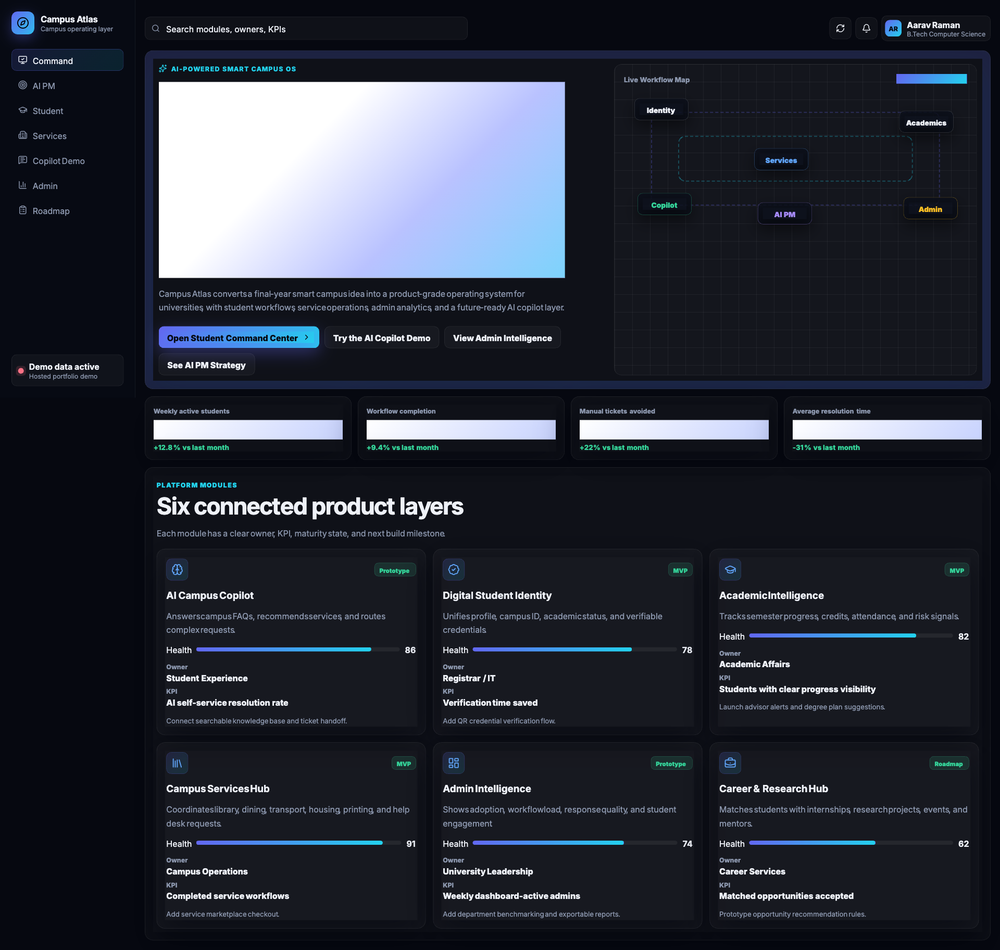
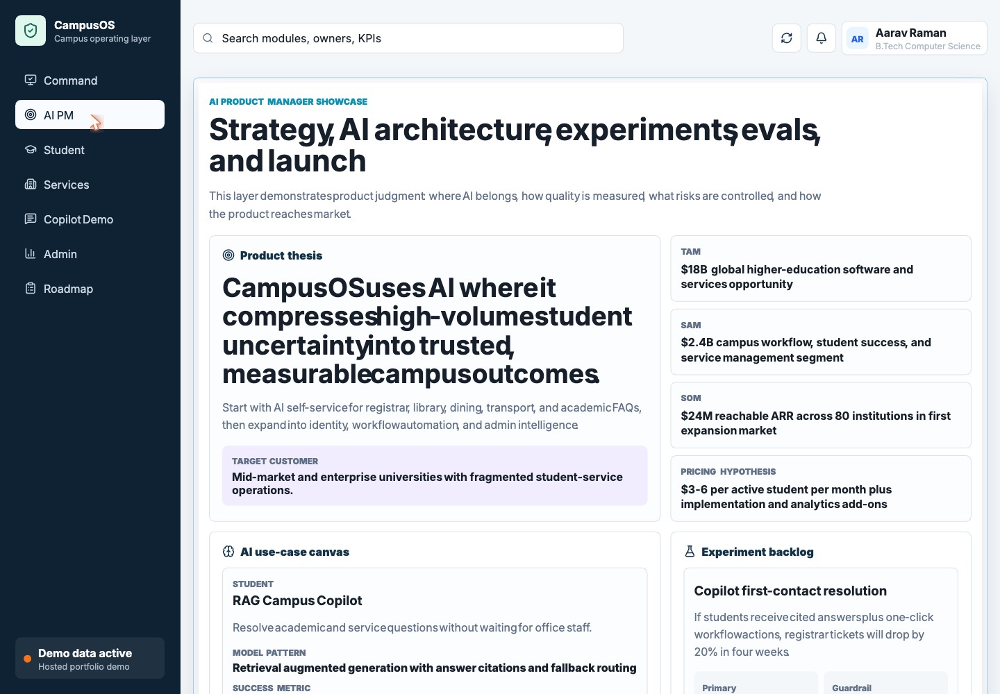
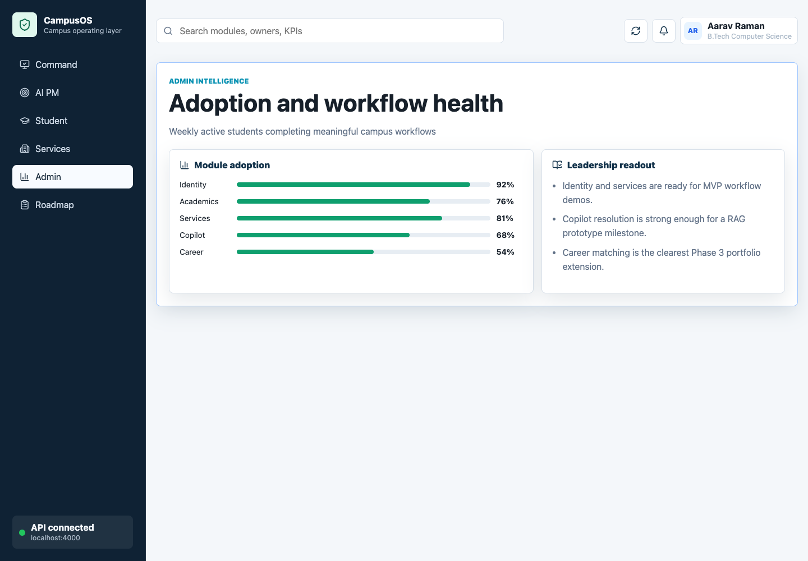
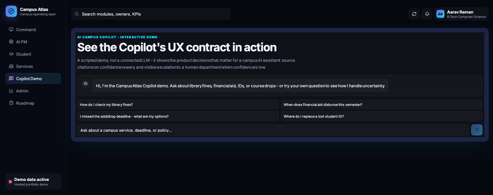

# Campus Atlas

Campus Atlas is an AI-native campus operating system case study exploring how universities can unify student services, digital identity, academic workflows, and AI assistance into one measurable product layer.

This is not positioned as a first-of-its-kind startup claim. Higher education already has AI assistants, campus apps, chatbots, and service automation platforms. Campus Atlas is a focused case study that shows how I would frame the problem, design the AI product, define metrics, manage risk, and plan an MVP.

## Live Demo

[Open the Campus Atlas prototype](https://devothamgn321.github.io/campus-atlas/)

## What This Demonstrates

- AI product strategy and customer wedge
- RAG-based campus copilot concept
- Student service workflow design
- AI evaluation and responsible AI guardrails
- KPI, experiment, roadmap, and GTM thinking
- Working React + Express prototype

## Prototype Scope

- Student command center with profile, academic progress, tasks, and credentials
- Campus Copilot preview with prompts and sample workflow
- Campus services hub for library, dining, registrar, and transport
- Admin intelligence dashboard with adoption and workflow metrics
- AI PM operating room with strategy, use cases, experiments, evals, governance, and launch plan
- Mock API serving the product and AI PM data

## Product Screens

### Command Center



### AI PM Operating Room



### Admin Intelligence



### Copilot Demo



## Tech Stack

| Layer | Technology |
|---|---|
| Frontend | React, Vite |
| API | Node.js, Express |
| Styling | CSS |
| Data | Mock JSON |

## Project Structure

```text
campus-atlas/
├── apps/
│   ├── web/        # React prototype
│   └── api/        # Express mock API
├── docs/
│   ├── product/    # PM and AI product artifacts
│   ├── architecture/
│   └── roadmap/
└── package.json
```

## Run Locally

Install dependencies:

```bash
npm install
```

Run the frontend:

```bash
npm run dev:web
```

Run the API:

```bash
npm run dev:api
```

Local URLs:

```text
Frontend: http://localhost:5173
API:      http://localhost:4000
```

Production build:

```bash
npm run build
```

## API Endpoints

```text
GET /api/overview
GET /api/modules
GET /api/metrics
GET /api/services
GET /api/student-profile
GET /api/copilot
GET /api/roadmap
GET /api/ai-product-strategy
```

## Key Docs

- [Customer Discovery](docs/research/Customer-Discovery.md)
- [AI PM Portfolio Case Study](docs/product/AI-PM-Portfolio-Case-Study.md)
- [AI Product Strategy](docs/product/AI-Product-Strategy.md)
- [AI Evaluation Plan](docs/product/AI-Evaluation-Plan.md)
- [Experiment Backlog](docs/product/Experiment-Backlog.md)
- [User Journeys](docs/product/User-Journeys.md)
- [GTM Launch Plan](docs/product/GTM-Launch-Plan.md)
- [Metrics Framework](docs/product/Metrics.md)
- [System Architecture](docs/architecture/System-Architecture.md)
- [Roadmap](docs/roadmap/Roadmap.md)

## Status

Portfolio prototype. The current implementation uses mock data and is intended to demonstrate AI PM thinking, product architecture, and prototype execution.
