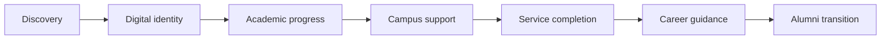
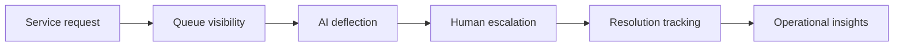
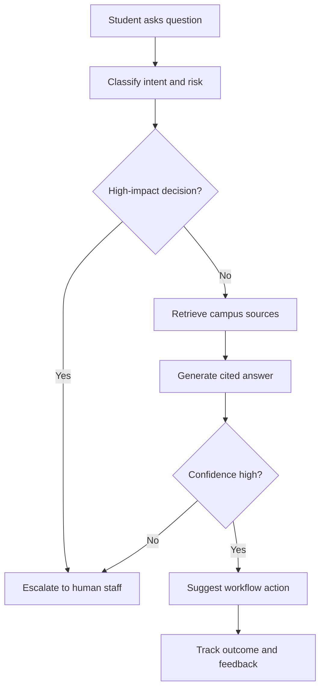

# User Journeys

## Student Journey

### Journey Notes

| Stage | User need | Campus Atlas response |
|---|---|---|
| Discovery | Find the right service or resource | Campus Copilot and searchable service hub |
| Digital identity | Access profile, ID, documents, and credentials | Student command center |
| Academic progress | Understand credits, attendance, tasks, and standing | Academic intelligence panel |
| Campus support | Resolve questions without visiting multiple offices | RAG copilot with citations and handoff |
| Service completion | Complete library, dining, registrar, and transport tasks | Closed-loop service workflows |
| Career guidance | Find internships, research, and mentors | Career hub roadmap |
| Alumni transition | Verify records after graduation | Digital credentials layer |

## Admin Journey

### Journey Notes

| Stage | Admin need | Campus Atlas response |
|---|---|---|
| Service request | Understand incoming student demand | Workflow and service volume tracking |
| Queue visibility | See bottlenecks by department | Admin intelligence dashboard |
| AI deflection | Reduce repetitive manual answers | Campus copilot for high-confidence answers |
| Human escalation | Handle sensitive or low-confidence cases | Escalation logic and staff handoff |
| Resolution tracking | Measure service quality | Completion, CSAT, repeat-contact metrics |
| Operational insights | Improve staffing and process decisions | Department-level analytics roadmap |

## AI Copilot Journey

### AI PM Decisions

- Use AI for discovery, guidance, and workflow routing.
- Require citations for policy and academic answers.
- Escalate high-impact or low-confidence cases.
- Measure success through resolved workflows, not chat volume.
- Feed failure modes into the experiment backlog and evaluation set.

